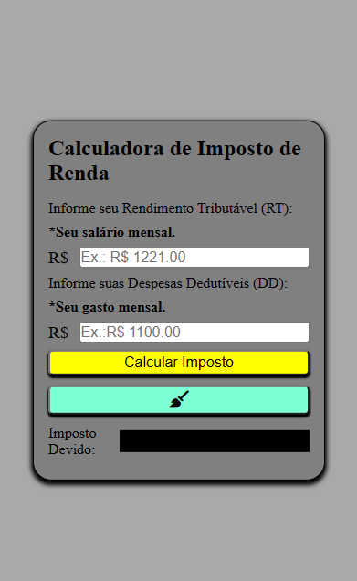

# Calculadora de Imposto de Renda

Uma calculadora para cálculo básico com base na Renda Tributária (RT) e nas Despesas Dedutiveis (DD).

## Layout

## Demonstração
[Calcular Imposto de Renda](https://bminority.github.io/impostoDeRenda/)

## Funcionalidades
 [x] - Calculo do Imposto Devido para declaração do Imposto de Renda.

## Tecnologias utilizadas
 - HTML
 - CSS
 - JAVASCRIPT

## Desenvolvido por
 - Bruno Coelho
 - Email: brunocoelho66@gmail.com
 - [Linkedin](https://www.linkedin.com/in/dev-bcoelho/)